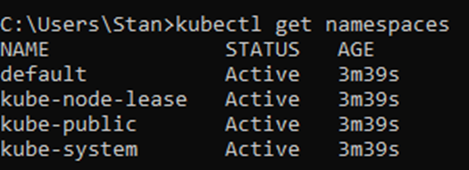
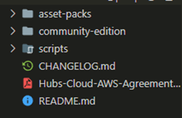
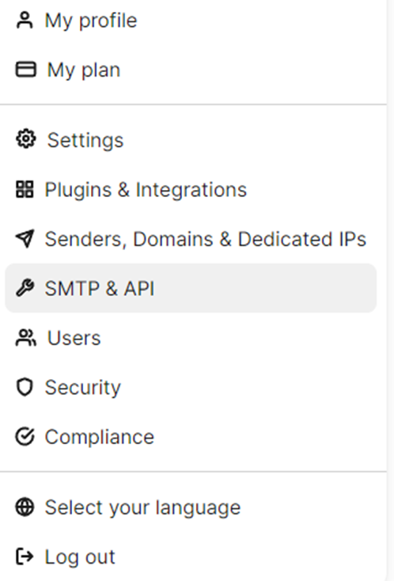
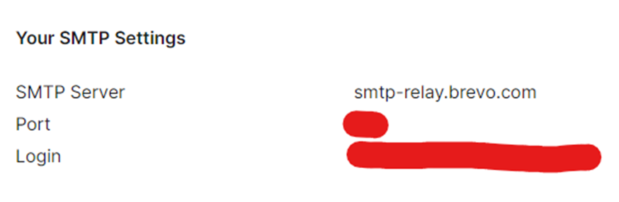
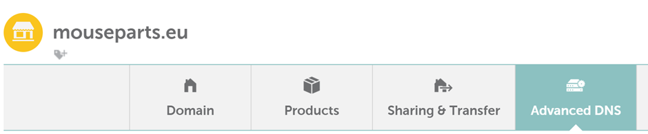
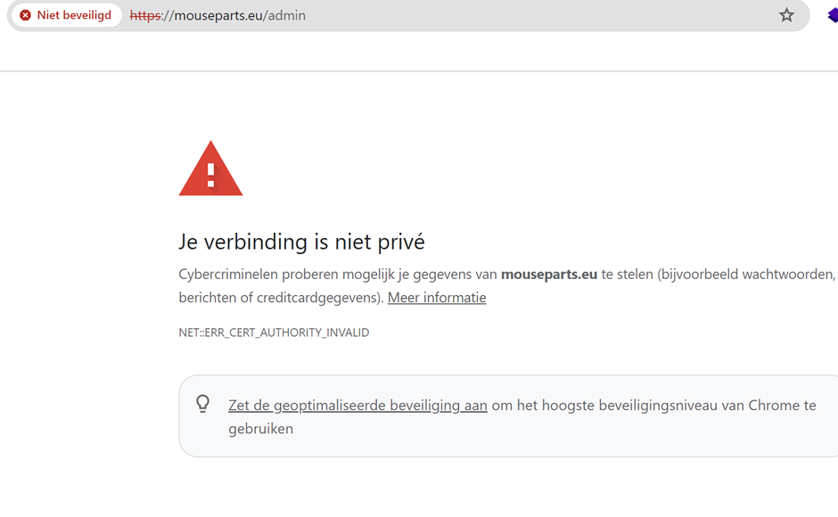
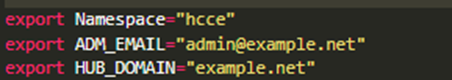
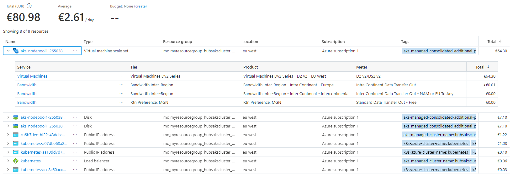
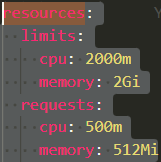
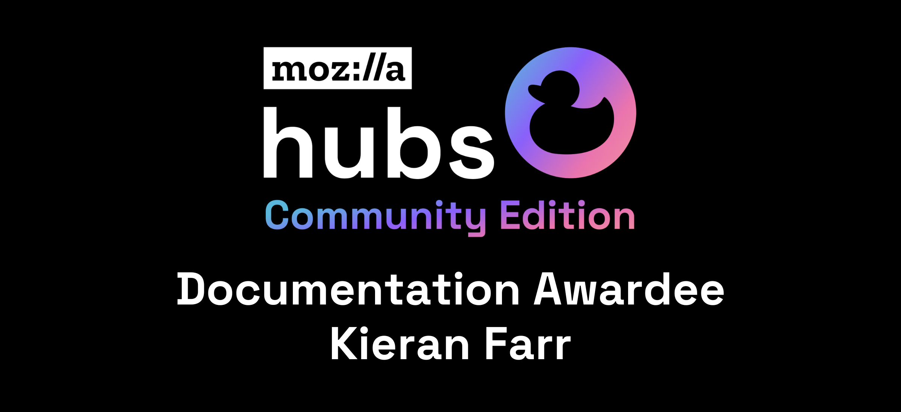

---

> [!IMPORTANT]
> **Editor's Note:** This article is based on the bash version of Community Edition, to follow along you will need to use the bash scripts from https://github.com/Hubs-Foundation/hubs-cloud/tree/bash-version

Hello! Before we start, let’s do a quick introduction. My name is Stan, a computer science student that loves to travel and play sports. I first came into contact with Hubs as an intern for a company that worked a lot with Mozilla Hubs to deliver experiences requiring accessibility that only Hubs could offer. To make these experiences unique and fit the requirements of customers, they have made custom clients. It was a simple but weird process where you could change the frontend of the application, aka the Hubs Client as I like to refer to it. Since the launch of Community Edition, the application still works the same way. But the process of deployment changed.

This post is here to help you start up your own Mozilla Hubs instance using Kubernetes on Microsoft Azure, how to prepare for large scale events and what kind of costs you can expect. I probably used some jargon already, but later in my post those terms will be made clear.

Go to [Tips and tricks](#tips-and-tricks) to know what do if an issue arrises during the blog.

Let’s start, shall we?

## Prerequisites

There are a few resources we need to install and download.

### Kubernetes

Kubernetes is a system that allows you to automatically scale, deploy and manage applications that are containerized (source: [https://kubernetes.io/](https://kubernetes.io/)). To use Kubernetes you will need to install the `kubectl` Command-Line-Interface for your operating system, in my case Windows, [here](https://kubernetes.io/docs/tasks/tools/).

### Azure

**Azure CLI**

We also need to be able to create and access our servers on Microsoft Azure. To do that we can use the `az` CLI (Command-Line-Interface) [Download here](https://learn.microsoft.com/en-us/cli/azure/install-azure-cli-windows?tabs=azure-cli).

**Azure subscription**

**_Important, you also need an account. If you have not used azure in the past you can get $300 USD worth of credits, but you will need to add a credit card. It is also worth to note that this post is made with the [Pay-As-You-Go](https://azure.microsoft.com/en-us/pricing/purchase-options/pay-as-you-go/) plan._**

### SMTP server

Brevo is used for our SMTP server in this tutorial. You can use any other SMTP server you want as long as it has username/password authentication and a public port and address. You can sign up at the following link: [https://www.brevo.com/](https://www.brevo.com/). [Later ](#smtp-credentials)down in the post we will be going more in-depth about the setup of Brevo.

### Domain

You need to own a domain; this domain can be used by any provider. In this example we will use Namecheap to demonstrate the installation of Hubs CE. [Later ](#dns-and-domain)down in the post we will be going more in-depth about the setup of Namecheap and the DNS-servers associated with the proces.

**Before starting I would recommend you look into the costs further down below [chapter ](#costs)because the hardware cannot be changed after cluster creation!**

# Setting up the Azure environment

## Create a Resource Group

Before you can create a cluster, you will need to create a Resource Group. In Azure, the Resource Group is like a folder. It's a container that holds all the resources (like virtual machines, databases, storage accounts, etc.) that are part of a specific project or application. You create a Resource Group and then add the necessary resources to it. This way, you can manage, deploy, and monitor all the resources within the group collectively.

`az group create --name myResourceGroup --location westeurope`

You can name the Resource Group whatever you want, but **don’t forget it**. You will need to use it multiple times in this tutorial.

Create a network security group

`az network nsg create --resource-group myResourceGroup --name myNSG`

And the following 3 rules

`az network nsg rule create --resource-group myResourceGroup --nsg-name HubsCE --name rule-name-1 --priority 1000 --direction Inbound --access Allow --protocol Tcp --source-address-prefixes '*' --destination-port-ranges 4443`

`az network nsg rule create --resource-group myResourceGroup --nsg-name HubsCE --name rule-name-2 --priority 1001 --direction Inbound --access Allow --protocol Tcp --source-address-prefixes '*' --destination-port-ranges 5349`

`az network nsg rule create --resource-group myResourceGroup --nsg-name HubsCE --name rule-name-3 --priority 1002 --direction Inbound --access Allow --protocol Udp --source-address-prefixes '*' --destination-port-ranges 35000-60000`

## Create a Kubernetes cluster

Let’s uncover what AKS is before we make an AKS cluster. It's helpful to know about containers. Imagine containers are lightweight, portable units. Containers ensure that the application runs consistently across different environments, from your laptop to a cloud server.

Now, consider AKS as a specialized service in Microsoft Azure that simplifies the deployment, management, and scaling of containerized applications using Kubernetes. Kubernetes is an open-source container orchestration platform that automates the deployment, scaling, and management of containerized applications.

Imagine you have a shipping yard where you need to manage the movement of various containers (applications). Each container has specific requirements, destinations, and dependencies. Managing this manually would be complex. Here, AKS is like an automated system that organizes, schedules, and monitors the movement of these containers efficiently.

Key points of Kubernetes:

- Open-source container orchestration platform.
- Can be deployed on various cloud providers (AWS, Azure, GCP) or on-premises.
- Requires manual setup, management, and maintenance.

What is the keypoint of AKS:

- A managed Kubernetes service offered by Microsoft.
- Streamlines the deployment and management of Kubernetes clusters on the Azure cloud.
- Provides additional Azure-specific integrations and features.
- Offers automated updates, scaling, and maintenance, reducing the operational burden on users.

So, what is the difference between Kubernetes and AKS? Kubernetes is an open-source platform, so each company can essentially borrow it for their own use. That's what AKS is. It is Microsoft offering a way to use Kubernetes on their Azure platform with their resources with some added intelligent tools.

So now that you know what AKS is, let’s create an AKS cluster

If you will use Hubs CE for a personal purpose that is not large scale, you use the f2s variant, but for larger events I would go for the F8s. More information about scaling in [Scaling for large events](#large-events)

CLUSTERTYPE Personal use -> Standard_F2s_v2
CLUSTERTYPE Large scale use-> Standard_F8s_v2

`az aks create -g myResourceGroup -s CLUSTERTYPE -n myAksCluster -l westeurope  --enable-node-public-ip --node-count 2 --network-plugin azure`

You will get a response in your command line if your cluster has been successfully created, but this might take some time.** Get some coffee in the meantime 😊**

### Connect to AKS Cluster

Download kubelogin with the following command: _`az aks install-cli`_

Currently the `kubectl` command does nothing, because it does not have the credentials of your AKS cluster. To do so you can use:

    az aks get-credentials --resource-group myResourceGroup --name myAKSCluster

You can verify if it has connected correctly if you do:

    kubectl get namespaces

and you should get an output like this.

# How to get CE on your AKS cluster

Great, you have an AKS cluster now. But what now?

## Download Community Edition

Go to [https://github.com/mozilla/hubs-cloud/tree/master](https://github.com/mozilla/hubs-cloud/tree/master) and download as ZIP. If you have git installed, you can just clone the repository [https://github.com/mozilla/hubs-cloud.git](https://github.com/mozilla/hubs-cloud.git).

## Get to know Community Edition

Once download, you can see the zip contains the following files. I am using Visual Studio Code in this example. But you can use any text-editor of your choice!

If you navigate to community-edition, you can see some more files. These files are the core of the new workflow of Hubs CE.

### Cbb.sh

This file is for running cerbotbot which enables you to add SSL certificates to your Hubs instance, which is required for it to run properly and securely.

### Render_hcce.sh

This is the most important file. Here you will have to fill in your credentials so the Hubs components can be configured correctly. There are a lot of variables. But we will get into that in the next step.

### .yam files

Besides the readme, there are 2 .yam files present in the community-edition folder. These files can be seen as templates. If you are familiar with YAML you might think that it is supposed to be .yaml. But it is not. This is an easy way to make a distinction between the so-called templates and the actual YAML files that have the correct content in them. In the example below you can see $Namespace among the other credentials. These will be replaced by the values you write down in render_hcce.

## Configure render_hcce.sh

Go to render_hcce.sh and fill in the following environment variables:

**HUB_DOMAIN**

This is the domain of the eventual Hubs client e.g. mycooldomain.com.

**ADM_EMAIL**

The email that is automatically granted administrator privileges from the start.

**Namespace**

The namespace where the resources will be assigned to. You can see it as a tag to differentiate the same resources from one another. You can leave it as the default “hcce” value.

**DB_USER**

The username credential for your Postgres database

**DB_PASS**

The password credential for your Postgres database

**DB_NAME**

The name of your Postgres database

**DB_HOST**

The hostname of your database

**DB_HOST_T**

The hostname of your pgbouncer

**PGRST_DB_URI**

The URI of your postgrest database

**PSQL**

The URI of your postgrest database

**SMTP_SERVER**

The address of the SMTP server

**SMTP_PORT**

The port of the SMTP server

**SMTP_USER**

The username of the SMTP server

**SMTP_PASS**

The password of the SMTP server

**SKETCHFAB_API_KEY**

Api key of your Sketchfab account

**TENOR_API_KEY**

Api key of your Tenor account for some nice gifs

Now that you know what each variable entails. You can fill them in. Most of these values can be left at default if you just want a working Hubs instance. But if you also want to have more security, you should change the default credentials of the Postgres database!

## SMTP credentials

In this tutorial I will use Brevo as a mail service. I have been using Brevo for a while now for multiple projects of mine. And they also have a free tier :). Once you have made an account on Brevo, navigate to “SMTP & API”.

And you will see a screen with your credentials. Your password is below these credentials. Copy these credentials over to your render_hcce.sh file to their place. Use the table above to fill in the correct values.

# Apply & deploy your configuration

Once you have filled in the variables with your desired values. You can go ahead and deploy your configuration. It is really simple. Navigate to /community-edition in a command line tool. And run the following command:

    bash render_hcce.sh && kubectl apply -f hcce.yaml

You should see a lot of things being created.

You can verify it by doing:

    kubectl get deployments,svc -n hcce

and you should get an output similar to this:

What you can see is that the service/lb has an external-ip. **Please write down the external-ip address of this service. You will need it in the next chapter.**

## DNS and Domain

In this tutorial I will use Namecheap since I buy my domains off them for cheeky prices. You can use other domain providers, but I personally don’t have experience with them. Go to your domain on Namecheap. Go to “Advanced DNS”

Remember when I told you to [note the IP of the service/lb down](#apply-&-deploy-your-configuration)? Now you will need the IP address. Go and make four new entries:

Type: A Record, Host: @, IP: service/lb IP address, TTL: automatic
Type: A Record, Host: assets, IP: service/lb IP address, TTL: automatic
Type: A Record, Host: cors, IP: service/lb IP address, TTL: automatic
Type: A Record, Host: stream, IP: service/lb IP address, TTL: automatic

**DON’T WRITE DOWN 34.90.22.216!**

The @ is for your root domain. The A Records with assets, cors and stream as hosts are for your subdomains. Keep in mind that it can take 24 hours or more for DNS to propagate, but normally it works within 1 hour.

# Manage your community edition

Community edition is still being developed and will be for the coming future. Of course you would like to keep it up to date too. But how can you do so?

## Update

The Hubs team pushes a new hcce.yam with updated information within the document. So you download the new hcce.yam. Replace the old one. And just

    render_hcce.sh && kubectl apply -f hcce.yaml

After that you will need to delete the deployment so the new image can be pulled again.

    kubectl delete deployment hubs

    bash render_hcce.sh && kubectl apply -f hcce.yaml.

## Pause

It is possible to pause running deployments on your cluster. This helps with keeping costs down when you are not using the cluster. Most of the time 80% of your bill is the price for running your cluster. So, this can save a lot when you pause your cluster. I can't give exact estimates, but it will be noticable.

You can do so with the following commands:

    kubectl scale --replicas=0 deployment --all -n hcce

And to unpause the deployments you can do this.

    kubectl scale --replicas=1 deployment --all -n hcce

# Certbotbot

Now that you have a running Mozilla Hubs Community Edition stack of components and you try to access it from your domain you will get a message that the website is unsafe because of a lack of SSL certificates.

Certbotbot comes here to help you by making it free and simple to request SSL certificates.

As mentioned earlier there is another .sh file besides render_hcce.sh, cbb.sh. Again this file has some variables you will need to fill in.

These are the default values, but you can adjust them to your needs.

`bash cbb.sh`

An output like this should be within your terminal.

If cerbotbot is taking a while to finish just a single domain. You can find the logs of the pod by doing

    kubectl logs -f -n hcce certbotbot-http

After this you will want to go to your text-editor once more. Because the domain is not using your root certificate yet. So go to your hcce.yam, search for

`- --default-ssl-certificate=$Namespace/cert-hcce`

and replace it with

`- --default-ssl-certificate=$Namespace/cert-$HUB_DOMAIN`

And go and do

    bash render_hcce.sh && kubectl apply -f hcce.yam

## Verify your installation

Go to your domain and click the little icon left of the domain. And The certificate should say it has been issued by R3, Let’s Encrypt.

You can now host epic events on your own Mozilla Hubs Community Edition :)

### If voice chat is not working

Navigate to portal.azure.com

After entering the commands proceed to portal.azure.com

Network Security Groups -> HubsCE -> Subnets -> Associate (top-left)

Select the virtual network that contains your clustername and select  "aks-subnet" as Subnet

## Costs

This is a simplified overview of possible costs related to the hardware you use. Append the snippet below when creating a cluster with a value that isn't the default.

These are the costs you can expect when running these as your clusters virtual machine, but you can get more accurate data from the Azure calculator and do all kinds of math there [https://azure.microsoft.com/en-us/pricing/calculator/](https://azure.microsoft.com/en-us/pricing/calculator/).

To explain the table below

- Azure VM Name, the name of the virtual machine
- Azure VM Series, the series of the virtual machine
- vCpu(#), the amount of cores/threads offered by Azure for said VM
- CCU Min, the **recommended **minimum of concurrent users
- CCU Max, the **recommended **maximum of concurrent users
- Approx. Cost (US$/hr) in Azure, the cost per hour provided by the above mentioned pricing calculator.

Azure VM NameAzure VM SeriesvCPU (#)CCU MinCCU MaxApprox. Cost (US$/hr) in AzureStandard_B2sB-series21020$0.0416Standard_B4msB-series22040$0.1660Standard_B8msB-series24080$0.3330Standard_F2s_v2Fsv2-series24080$0.0846Standard_F4s_v2Fsv2-series480160$0.1690Standard_F8s_v2Fsv2-series8160320$0.3380Standard_F16s_v2Fsv2-series16320640$0.6770Standard_F32s_v2Fsv2-series367201,440$1.3530Standard_F48s_v2Fsv2-series489601,920$2.0300Standard_F72s_v2Fsv2-series721,4402,880$3.0450
For my personal clusters, I have had a monthly cost of around 80 euros. In the screenshot below is an overview of what I have had to pay for certain resources. This is with me sometimes disabling the cluster when it is not in use or demand, this saved my 30/40 euros.

If you would like to see your costs you can go to [portal.azure.com](https://portal.azure.com).

Cost management -> Cost analysis -> By resource group -> Click on whetever resource you would like.

## Large events

If you are expecting to host an event for a larger crowd than usual? Follow this part of the blog to find out more.

## Horizontal vs Vertical scaling

There are 2 types of scaling

Horizontal: You scale the **AMOUNT **of instances; replicas

Vertical: You scale the **SPECS **of instances; ram, storage, and CPU

Vertical scaling gets exponentially more expensive, while horizontal scaling increases complexity of the system.

The default values for scaling have been set to 1 in the `hcce.yam`. So, I made a hcce.yam file which contains the vertical scaling properties. I also created a new file, called `scalers.yaml`. This file contains all the horizontal load balancers. You can download these files from my repo.

**IMPORTANT NOTE, BY USING THIS HCCE.YAM FILE YOU NEED TO HAVE THE MAXIMUM AMOUNT OF SPECS AVAILABLE OR YOUR PODS WON'T START, DEFAULT VALUES OF THE FILE REQUIRE 8 CPU, 12 GIb**
[

GitHub - TophoStan/HubsCEFiles

Contribute to TophoStan/HubsCEFiles development by creating an account on GitHub.

GitHubTophoStan

](https://github.com/TophoStan/HubsCEFiles)
After you have downloaded these files you can replace the new hcce.yam with your old one. And you can also add the `scalers.yaml` to your folder. Your namespace is "hcce" if it has been untouched else you need to change to value after the -n

`kubectl apply -f scalers.yaml -n YOUR_NAMESPACE`

`bash render_hcce.sh && kubectl apply -f hcce.yaml`

These values are arbitrary and they can be changed to your desires. Here is how you can customize it. In the new hcce.yam file resources has been added. You have limits and requests. Limit is the max resource amount and requests the minimum that will be **allocated**.

1000m = 1 CPU core
1Gi = 1.028 GB

## Tips and tricks

Kubernetes related tips and tricks can be found in this article written by Kieran Farr. It can be helpful to read this before going in depth with your installation of Hubs Community Edition which uses Kubernetes.
[

Tips and Tricks for Deploying Hubs Community Edition to Google Cloud Platform

Perfect for those new to Kubernetes, Kieran Farr’s guide takes you through many useful lessons and recommendations to consider when getting started with Community Edition.

Creator LabsKieran Farr

](**GHOST_URL**/tips-and-tricks-for-deploying-hubs-community-edition-to-google-cloud-platform/)
You can go to the [#community-edition](https://discord.com/channels/498741086295031808/1158476691384062012) channel and search for you error message.

Don't paste the entire error in the search bar, but by keyword. And Filter on channel by doing in:#community-edition and then append your subject. For example if you have issues with sound, look for audio. Or if you have trouble with a certain deployment like coturn, you can search for coturn.

If you are unable to find it, and have thought long and hard. Just ask a question in the [#community-edition](https://discord.com/channels/498741086295031808/1158476691384062012) channel! But PLEASE don't **just **ask, "help I have error". Give more context surrounding the issue, "What did you do?", "What does it say?" ,"What did you expect?", "Have you tried an alternative". And be nice, everyone is trying to help :).

The hubs community has a lot of great members with each of them being unique by expertise in certain areas. I don't have any names, but if you look trough the CE channel, you will certainly find out who the knowledgeable people are <3.
