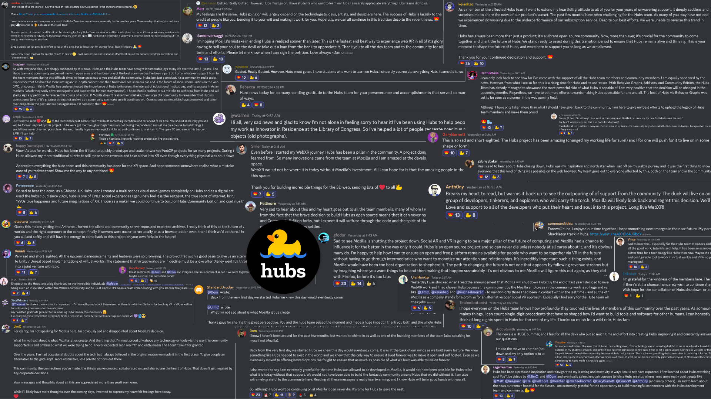
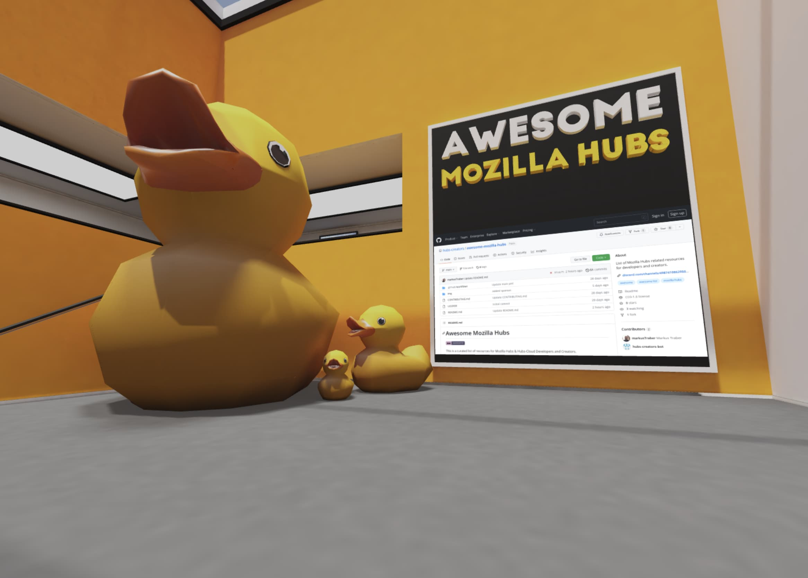
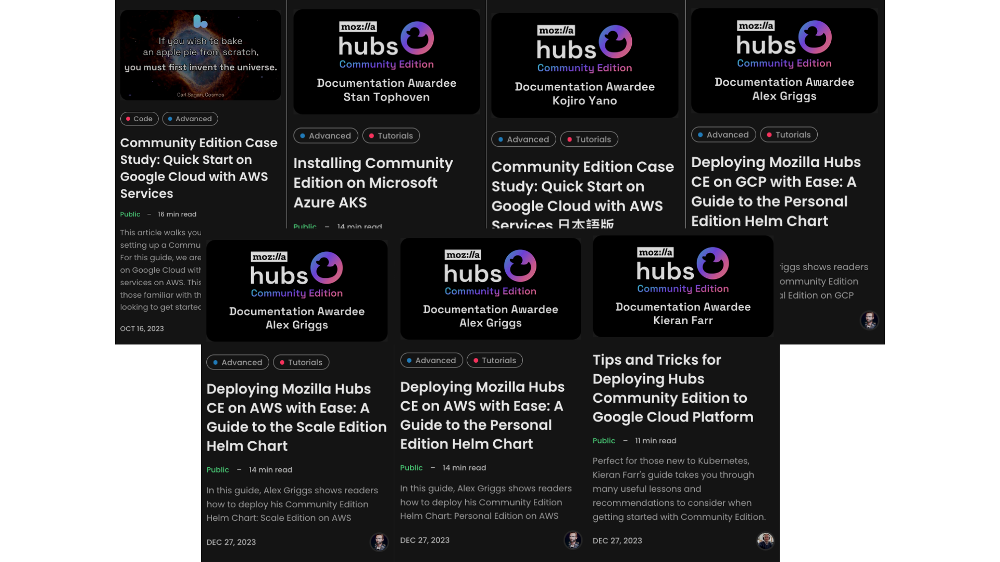

---

## The News About Hubs

On February 13, 2024, Mozilla announced an organization-wide restructuring impacting a number of products housed within the Mozilla Corporation. Unfortunately, Hubs is one of the products impacted and it will be shut down later this year. This will be a multi-month process with three members of the Hubs team overseeing the transition.

We look forward to having more time to reflect on the full history of the Hubs project, where we succeeded, where we came up short, our feelings about it ending, and Hubs’ overall legacy. However, right now our only goal is to support you as you have so lovingly supported us after learning this sad news and **over the last six years.**
Tributes from our incredible community in the Discord Server

## What This Means For Mozilla-run Services

While we hope that Hubs can have a vibrant life outside of Mozilla, there are a number of pieces of Hubs that will end as part of the shutdown. These include **the Hubs Demo Server (hubs.mozilla.com)** and **the Managed Subscription**, the two services actively maintained by Mozilla that most of our users rely on. Additionally, the sunset plan and timeline for Hubs Cloud has not changed; for more information about the Hubs Cloud sunset, [please see our announcement](__GHOST_URL__/welcoming-community-edition/) from last Fall.

Furthermore, after the conclusion of the shutdown, **Mozilla will not continue active development or maintenance of Hubs codebases and other community resources.**

## Shutdown Timeline

Our goal is to give you time to consider your options and make this transition gracefully. This will be a multi-month process, with the goal of concluding Mozilla’s work on Hubs **by May 31, 2024. **Here are the key dates…

- **March 1, 2024** | The creation of new subscriptions will be disabled. Existing subscriptions will be able to continue using their instances until the full shutdown is complete. The demo server will continue to function as normal.
- **April 1, 2024** | A tool to download your data will be released. Demo users and subscribers will be able to begin downloading their data.
- **\*\***May 31, 2024 **\*\***|Existing subscription instances and the demo server will be turned off. All Mozilla-run community resources and platforms will also be turned off.

It is important to note that this timeline is in parallel to [the existing Hubs Cloud sunset plan](__GHOST_URL__/welcoming-community-edition/), which remains unchanged.

## Your Data and Assets

For over 5 years, Mozilla has hosted services for the Hubs community to upload assets, create worlds, and host meetups. On the Demo Server alone, we see that you all have created **115,732 custom avatars, 215,923 scenes, and hosted meetups for close to 10 million attendees**. That represents an immense amount of creativity, innovation, and time.
A community-built scene led by artist [Cris Kevin Bjørndal](https://twitter.com/cris_k_b)
Our goal is to enable users who have assets hosted on Mozilla-run servers to download their data in a format compatible with Community Edition instances or other webXR platforms.

All data on Hubs is associated with user email addresses. We plan to release a tool for you to download** all uploaded media associated with your email, **including 3D models, audio files, image files, and video files uploaded through Spoke, as well as gLTFs of published spoke scenes and avatars. This tool will also make it possible to retrieve all Hubs URLs, including scene URLs, room URLs, avatar URLs, and spoke project URLs.

For the demo server, users will be able to download the data associated with your email address only. For subscription instances, this tool will make it possible for subscription owners to download all data from your Hub across all associated email accounts.

In addition to assets you have created, we understand that many of you rely on avatars, scenes, and other assets which have been published by the Hubs team over the years. Prior to shutdown, we plan to open source these assets and as many of the original .blend files as we can.

This tool for downloading data is still in development. In the meantime, we would like to hear from you about the data you would like to retrieve from the services that will be shut down. Please let us know your thoughts in this form: [https://forms.gle/ZLpuAPw9ZvCRbXR5A](https://forms.gle/ZLpuAPw9ZvCRbXR5A)

## Life Beyond Mozilla

**Hubs’ code is open source,** which means that it can have a life outside of Mozilla. Since Tuesday’s announcement, many former Hubs team members have returned to the Discord server to remind the community that **Hubs was built with life outside of Mozilla in mind**. The project’s commitment to open source and focus on self-hosted versions of Hubs mean that no one entity can determine Hubs' future; only this community can do that.

While Tuesday’s news was painful, we feel great relief knowing that the Hubs Cloud sunset is already underway and a number of you are already in the process of migrating to [Community Edition](__GHOST_URL__/welcoming-community-edition/). Community Edition is a **fully open source version of the Hubs codebase** that you can run on any platform that supports Kubernetes. Unlike Hubs Cloud or the managed subscription, **Community Edition instances are completely independent of Mozilla**. Since its release, we have been working with community developers to create documentation for how to host Community Edition across many platforms: [Award Announcement #1](https://discord.com/channels/498741086295031808/819200243177881640/1189619405018120202) | [Award Announcement #2](https://discord.com/channels/498741086295031808/819200243177881640/1199391657427222631)
Community Edition documentation.
As we spin down the Mozilla-run parts of Hubs over the coming months, one of our focuses will be to help as many people as possible make the jump to Community Edition and take more active roles in developing the exciting projects we have been working on. There are currently dedicated groups of community members contributing to the Blender Add-On, Behavior Graphs, Documentation, Bug Triage, and other feature development. We hope to see these groups grow in the coming months as Hubs’ future is handed over to the community.

## Supporting This Wonderful Community

In addition to the release of the data download tool, we will continue to support you during this process by making ourselves accessible to answer your questions, create tutorials, and host regular gatherings with our team as you transition. Unfortunately, this news does mean that our team will be shifting our focus away from the exciting, future-facing projects, such as Behavior Graphs, which we had been working on in recent months. Additionally, we may not be as responsive to your questions about the basics of Hubs as we have been in the past; we hope the community will continue to generously answer these questions from new users getting to know Hubs for the first time.

**We will continue to host weekly community meetups** during our usual time on Friday afternoons. This is a great place to ask questions about the specifics of the shutdown and connect with other supportive community members. We know that not everyone can make the regular meetup time, so we have added a number of information sessions throughout the next few weeks to accommodate more time zones. We will also continue to host our regular Blender-Add on and Behavior Graph meetups so that we can begin handing this exciting work over to you.

We have also added weekly **“Community Edition Setup” meetings** to the Discord server’s events calendar where we will help walk you through the process of setting up Community Edition instances. If you are unable to attend these regular meetings but have questions about the shutdown, please ping @michaelmorran in the Discord server and he will do his best to find another time to discuss.

We know that the prospect of transitioning to Community Edition or a new platform can be intimidating. Throughout the coming months, we hope to release tutorials and documentation to help make this process easier. We highly encourage developers and companies offering migration and self-hosting services to advertise in the #job-board channel of the Discord server using the “Hire Me” and “Purchase My Work” tags. Additionally, if you or your organization need assistance migrating to Community Edition, please fill out [this form](https://forms.gle/7L3vLG3kBTjkne3n7) and we will do our best to connect you with independent developers and organizations who can help: [https://forms.gle/7L3vLG3kBTjkne3n7](https://forms.gle/7L3vLG3kBTjkne3n7)

## How You Can Help

The Hubs team has been overwhelmed by the loving support we have seen in the Discord server following the sudden announcement. It is a testament to the spirit and generosity of this community that sets it apart from all other multiplayer VR platforms. We encourage you to continue helping your fellow community members in the following ways…

1. **Share this news.** Hubs has users from every corner of the world and we need your help to spread the word so that everyone has time to consider their options during this transition.
2. **Get started with Community Edition.** Many community members, including those without Kubernetes experience, have successfully set up instances by following our published tutorials. It is helpful to answer questions, document your process, and, if you can, contribute to Community Edition to improve it.
3. **Share tutorials for migrating to other platforms.** We know that Community Edition won’t be the right fit for everyone. Many community members will need help making the leap to other services where their assets are compatible. Please consider writing a migration tutorial and submitting it to our Creator Labs blog: [https://docs.google.com/forms/d/e/1FAIpQLSegEBt70aoZ4oWzlpShkijpS2zvbwcBph7HQuzSRYDDNEU0MQ/viewform](https://docs.google.com/forms/d/e/1FAIpQLSegEBt70aoZ4oWzlpShkijpS2zvbwcBph7HQuzSRYDDNEU0MQ/viewform)
4. **\*\***Share and celebrate the work of the wonderful people who make up this community. **\*\***Throughout the coming months, we will be organizing community celebration events and do our best to document all of the amazing work that has been done so far with Hubs. Consider sharing your projects in #show-and-tell and leave some encouraging comments for other creators.
5. **\*\***Take care and time to reflect.**\*\***This news is sudden, but we have time and an incredibly supportive community to support you. Don’t be afraid to get involved and ask for help.

Thank you all for your support of this team and the Hubs project ♥️ More soon.

- The Hubs Team
