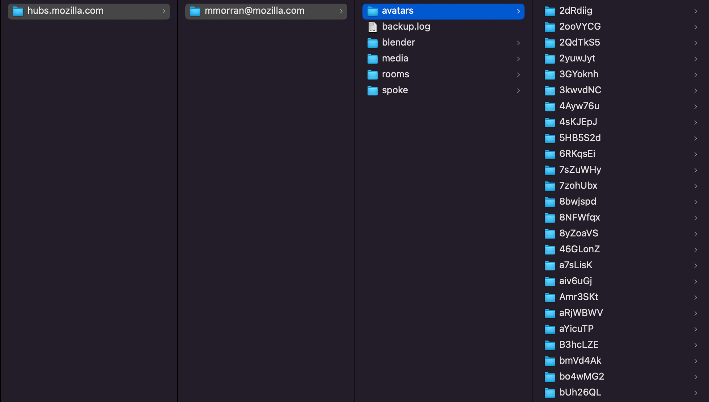
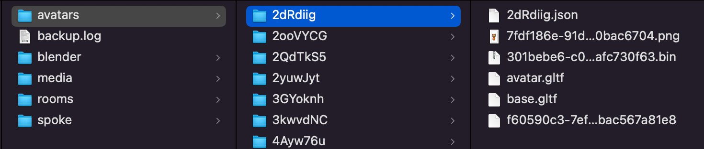
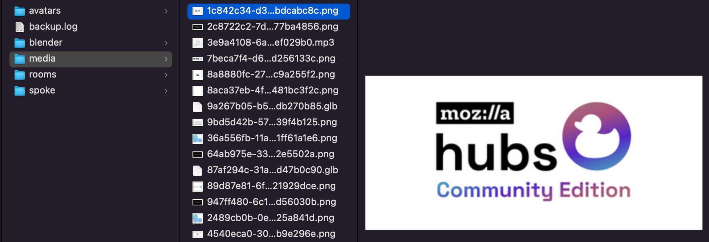
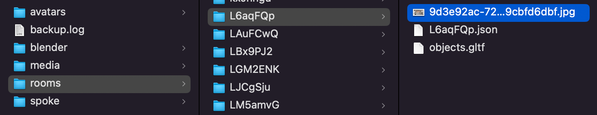
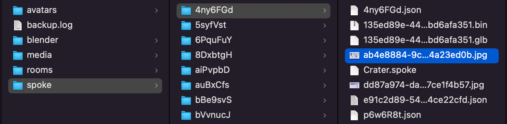
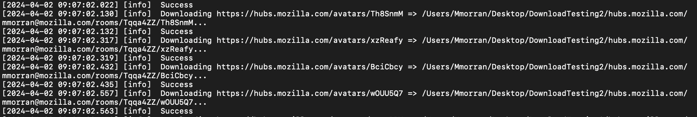

---

## Introduction

Today we are releasing a tool to allow Hubs users to export their data from Mozilla-run servers in bulk before [Hubs is shut down on May 31, 2024](__GHOST_URL__/sunset). While Hubs has always included methods for users to manually download the data they upload, this tool makes it simpler and more efficient for users to download all data associated with their email address from one interface.

In its current state, this tool is a native application that users will install and run directly on their computer. The tool is housed in [an open-source GitHub repository](https://github.com/MozillaReality/Hubs-Backup-Tool/) for anyone to download for free. At launch, there are three versions of the tool for MacOS, Linux, and Windows...
[MacOS Build](https://github.com/MozillaReality/Hubs-Backup-Tool/releases/download/v1.0.5/Hubs.Backup.Tool-darwin-x64-1.0.5.zip)
[Linux Build](https://github.com/MozillaReality/Hubs-Backup-Tool/releases/download/v1.0.5/Hubs.Backup.Tool-linux-x64-1.0.5.zip)
[Windows Build](https://github.com/MozillaReality/Hubs-Backup-Tool/releases/download/v1.0.5/hubs-backup-tool-win32-x64-1.0.5.zip.zip)
The Hubs Backup Tool interface

## About the Tool

The Hubs Backup Tool allows users to download the data associated with their email addresses from three types of servers...

A. Mozilla's **Demo Server** located on hubs.mozilla.com
B. Managed **Subscription Instances** with .myhubs.net domains
C. Self-hosted **Hubs Cloud** and Hubs Cloud **Community Edition** servers

In this blog, we'll unpack and explain more about the data that can be exported using the tool. However, if you would like to know more about **how to use the tool**, please consult these resources...

A. [Download Tool Written Documentation](https://hubs.mozilla.com/docs/download-data.html)
B. [Download Tool Tutorial Video](https://youtu.be/vnkgGLkcxuk)

If you have questions about the tool or trouble using it, the best way to get in contact with us will be to message us in our community [Discord Server](https://discord.gg/yxRFBGFT) or email us at [hubs-feedback@mozilla.com](mailto:hubs-feedback@mozilla.com).

## Exploring The Data

This tool allows users to download 5 types of data from a Hubs instance: avatars, scenes created in Spoke, scenes uploaded as a .glb file, media uploaded to Spoke, and media pinned in rooms. When a user exports their data, the application will create a number of folders on their computer to organize their data in the following configuration...
**- Instance Domain**
**- User Email**
**- Avatars**
   - Individual avatar ids
    - Avatar files
**- Blender (scenes uploaded as .glb files)**
   - Individual scene ids
    - Scene files
**- Media (media uploaded to Spoke)**
   - Individual media files
** - Rooms (media pinned within rooms)**
   - Individual room ids
    - Room media files
**- Spoke (scenes constructed in Spoke)**
   - Individual scene ids
    - Scene files
**- Backup log file**
Example of downloaded data folder structure
Let's take a closer closer at the data in each of the 5 categories and how it can be used after export...

**Avatars**
Example avatar data download
When downloading avatars, the tool will create a folder named with your avatar's unique avatar id, which contains the avatar's files and Hubs metadata. In the example image above, "2dRdiig" corresponds with the Foxr avatar hosted at [https://hubs.mozilla.com/avatars/2dRdiig](https://hubs.mozilla.com/avatars/2dRdiig) on Mozilla's demo server. Inside the exported folder, we can see that a .png thumbnail for the avatar, an avatar.gltf file containing the avatar itself, a .bin binary file containing the buffers for the avatar, and metadata in the form of a .json, base.gltf, and unextended files.

After downloading, many users may wonder how they can reconstruct and reuse their avatar in other environments. For webXR, a .glb is the single-file format that can port to most other environments, including other Hubs Community Edition instances. While the download tool does not export a single .glb file for avatars, it is easy to construct one using [Blender](https://www.blender.org/). Simply open Blender and import the avatar.gltf file; During the process, Blender should automatically detect the .bin buffer file and any other associated files referenced in avatar.gltf. Once imported to Blender, you can export a single .glb file to be re-used across webXR platforms.

**Scenes Uploaded as .glb Files (Blender)**
Example blender data download
For several years, the [Hubs Blender Exporter](https://github.com/MozillaReality/hubs-blender-exporter) has allowed users to construct and export entire Hubs scenes directly in Blender without having to use the Spoke interface. These scenes were then uploaded using the "Import from Blender" button on Spoke. The download tool allows these scenes to be exported as a unique category of data.

When downloaded, the tool will create a directory named with the scene's unique id. In the example above, we have exported [[[[https://hubs.mozilla.com/](https://hubs.mozilla.com/scenes/6jid9ef)s](https://hubs.mozilla.com/avatars/6jid9ef)](https://hubs.mozilla.com/scenes/6jid9ef)cenes[[[/6jid9ef](https://hubs.mozilla.com/scenes/6jid9ef)](https://hubs.mozilla.com/avatars/6jid9ef)](https://hubs.mozilla.com/scenes/6jid9ef)](https://hubs.mozilla.com/scenes/6jid9ef), a conference room scene created by Hubs Team Member Jim Conrad. Within the folder, we have the original .glb file of the scene, the .png thumbnail, and a {scene-id}.json file containing Hubs metadata about the scene. The .glb file can be easily ported to another platform or Hubs Community Edition instance.

**Media Uploaded to Spoke (Media)**
Example media data download
When constructing scenes in Spoke, users are able to host their media files individually by dragging-and-dropping directly into the Spoke interface. When uploaded, these assets are associated with the Spoke creator's email address and can be used in their scenes. The download tool allows users to export these audio, video, image, and 3D model files.

Within the downloaded "Media" folder, the uploaded files are listed and named for their unique file ids. In the example above, we have downloaded an image hosted at [https://uploads-prod.reticulum.io/files/1c842c34-d3bb-4ea1-89f6-c9ccbdcabc8c.png](https://uploads-prod.reticulum.io/files/1c842c34-d3bb-4ea1-89f6-c9ccbdcabc8c.png). For the demo server, all assets are hosted on uploads-prod.reticulum.io, our backend server.

**Media Pinned within Rooms (Rooms)**
Example room media data download
Outside of Spoke and the Hubs Blender-Add-On, Hubs users can customize their rooms with images, audio, urls, and more using [the pinning method](https://youtu.be/6QH-gMCfvbw?feature=shared&t=243) directly within a Hubs room. The download tool allows users to download all media pinned to rooms that they have created.

On download, the tool will create folders for each unique room id. In the example above, we have downloaded all pinned media for [https://hubs.mozilla.com/L6aqFQp](https://hubs.mozilla.com/L6aqFQp). In this case, only one .jpg image has been pinned to the space. Looking within objects.gltf with our text editor, we can see a list of pinned media nodes and their corresponding urls. If you have pinned external websites, YouTube videos, or other Hubs room urls within your room, look through objects.gltf to find their information. Lastly, within objects.gltf, we can also see information about the transform coordinates of the objects as they were pinned within our room.

**Scenes Constructed in Spoke (Spoke)**
Example spoke scene data download
The majority of Hubs creators will be familiar with creating projects and constructing scenes directly within the Spoke interface. When downloading data from these scenes, the tool will create a folder for each scene named with scene's project id from Spoke. In the example above, we have downloaded [https://hubs.mozilla.com/spoke/projects/4ny6FGd](https://hubs.mozilla.com/spoke/projects/4ny6FGd).

In the downloaded folder, we have exported a mixture of files and metadata from our scene. First, we have exported our .spoke and .glb files, which allow us to port this project to other Hubs instances or other 3D platforms on the web. These files are the same files which can be manually exported from the Spoke interface by going to File -> "Export legacy .spoke project" or "Export binary gltf (.glb)", respectively. We have also exported the automatically generated .jpg thumbnail of our scene.

Finally, within our folder, we have also exported a {project-id}.json and {scene-id}.json file that can help us identify the scene url of our project. In the example above, our scene with a project id of 4ny6FGd corresponds with the scene hosted at [https://hubs.mozilla.com/scenes/p6w6R8t](https://hubs.mozilla.com/scenes/p6w6R8t).

**Backup Log File (backup.log)**
Example backup.log
Finally, the tool will include a download log from the latest export with information about each file being downloaded. This file is helpful for troubleshooting and debugging. If you encounter any errors with your download, please share this backup.log file with our team so we can know how to help.

## Next steps

There is more work to be done over the coming weeks to refine this tool and make sure that all Hubs users are able to access all important data before May 31, 2024. If you have feedback about this tool, please connect with us in our community [Discord Server](https://discord.gg/yxRFBGFT) or in the the [open-source GitHub repository](https://github.com/MozillaReality/Hubs-Backup-Tool/). Furthermore, check back regularly for [new releases of the tool on GitHub](https://github.com/MozillaReality/Hubs-Backup-Tool/releases). We look forward to connecting with you!

- The Hubs Team
