In this documentation we’ll be going through a step by step guide on how to deploy your own custom managed version of Hubs using Community Edition. Myself **Hrithik**, I have now for a few years worked with hubs and hosted several large events on custom version of hubs using hubs-cloud (the predecessor of community-edition, available as a marketplace tool on AWS).

## Index

- **Prerequisites**
- **Initial Setup ( 4 Steps)**

1. Installing CLI Tools
2. Creating a Kubernetes Cluster in Digital Ocean
3. SMTP server setup
        a. Adding domain to elasticEmail
        b. Setting up SMTP Server
4. Generating Config File

- **Deployment Setup(2 Steps)**

1. Connecting Kubectl to Digital Ocean
2. Deployment to Cluster

- **Deployment (3 Steps)**

1. Linking your Domain
2. Making it Secure (SSL Certificates)
3. Enabling Audio Chat and ScreenShare

- **Development Setup (3 Steps)**

1. Custom Code and Deployment
2. Building Docker Image
3. Whitelisting domains and setting CORS

- **Management\*\***Tools\*\*
  Bonus: Installing a Kubernetes IDE

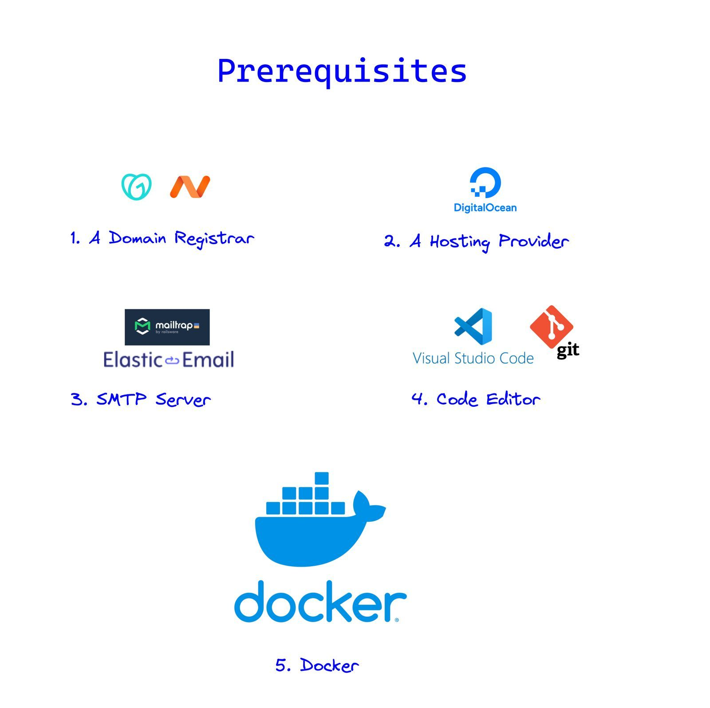Prerequisites

## Prerequisites

1. Buy a **domain** from a registrar like [Godaddy](https://godaddy.com/) or [Namecheap](https://namecheap.com/):
   In this tutorial we're going to use Godaddy, if your motive is to test something out, buying a .world or .life domain which comes for around $2 for first year would be a good start, also for new users Namecheap has some really coupons which offers .com domains at 50% discounts
2. [A Digital Ocean Account](https://www.digitalocean.com/) :
   To create an account on Digital Ocean if you don't have one, you can use my referral link below which will get you $200 in credits for 60days
   [https://m.do.co/c/fbf891840808](https://m.do.co/c/fbf891840808)
3. Account on [elasticemail.com](http://elasticemail.com/):
   a. Elastic Email offers us 100 emails a day which is enough for our needs
   b. In case you need to have an alternative smtp setup always helps, here is a link to an article by Mailtrap listing free smtp servers [https://mailtrap.io/blog/free-smtp-servers/](https://mailtrap.io/blog/free-smtp-servers/)
4. [VS Code](https://code.visualstudio.com/) or any other code editor installed on your machine and good to have git installed and setup as well
   a. Download VS code from [https://code.visualstudio.com/](https://code.visualstudio.com/)
   b. git can be downloaded via [https://git-scm.com/downloads](https://git-scm.com/downloads)
5. Docker & Docker Desktop installed
   a. Docker desktop can be downloaded from  [https://www.docker.com/products/docker-desktop/](https://www.docker.com/products/docker-desktop/) , currently I'm using  Docker version 24.0.7 for this tutorial
   b. For every version of kubernetes, there is a compatible version of Docker which can be found out here [https://github.com/kubernetes/kubernetes/blob/master/CHANGELOG/CHANGELOG-1.29.md](https://github.com/kubernetes/kubernetes/blob/master/CHANGELOG/CHANGELOG-1.29.md)

## Installing CLI Tools

### Initial Setup -Step 1/4

# Kubectl

### The Kubernetes command-line tool

Kubectl is installable on a variety of Linux platforms, macOS, and Windows. Install it for your operating system by visiting its installation documentation page shared here

- [Install kubectl on Linux](https://kubernetes.io/docs/tasks/tools/install-kubectl-linux)
- [Install kubectl on macOS](https://kubernetes.io/docs/tasks/tools/install-kubectl-macos)
- [Install kubectl on Windows](https://kubernetes.io/docs/tasks/tools/install-kubectl-windows)

## Doctl

### Official DigitalOcean command line interface

To install the latest version of doctl using Homebrew on macOS, run:

> brew install doctl

To install the latest version of doctl using Snap on linux or windows-wsl

> sudo snap install doctl

For more information visit [https://docs.digitalocean.com/reference/doctl/how-to/install/#step-1-install-doctl](https://docs.digitalocean.com/reference/doctl/how-to/install/#step-1-install-doctl)

## Creating a Kubernetes Cluster in Digital Ocean

### Initial Setup - Step 2/4

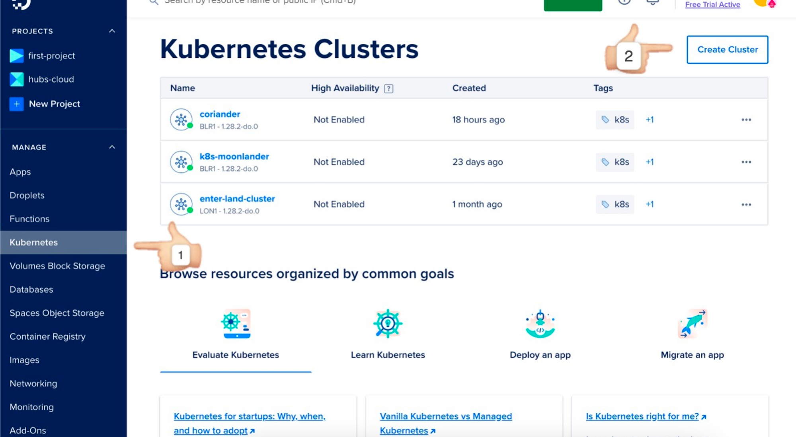

1. Log-in to the Digital Ocean dashboard ([https://cloud.digitalocean.com/](https://cloud.digitalocean.com/)). In the “Manage” dropdown in the left sidebar, select “Kubernetes”. (alternatively [https://cloud.digitalocean.com/kubernetes/](https://cloud.digitalocean.com/kubernetes/))
2. After we have our Kubernetes Clusters, we’re going to click on ‘Create Cluster’ ( button on top right) to spin up our own cluster.

## Filling up the Cluster Details

Now, we're on the page where Digital Ocean asks for what are the configurations we need for our cluster, let's go ahead

**Datacenter Region: **Choose your preferred datacenter region., the one closest to me is Asia - BLR1
Selecting your Datacenter Region
**Scaling Type: **Select a Fixed or Autoscale as per your needs, we're going to select Fixed scale for our tutorial
Scaling Type, Node Pool Plan & Number of Nodes selection
**Node Pool**: Here, it's essential for us to understand what a Node Pool is and how the number of nodes plays a crucial role. Node Pools in Kubernetes refer to groups of nodes within a cluster that share the same configuration, such as machine type, disk type, and Kubernetes labels.
We have selected the Node Plan of $24/mo i.e of 2vCPUs and 4GB Ram and we are adding 3 Nodes in our case,a minimum of 2 nodes are recommended while development, afterwards to run your instance with 30-60 Concurrent Users you'a single node is **enough **(afterwards here refers to the point where you have successfully deployed your Custom Code)
If you need high Availability you can turn this on (we don't need in our case)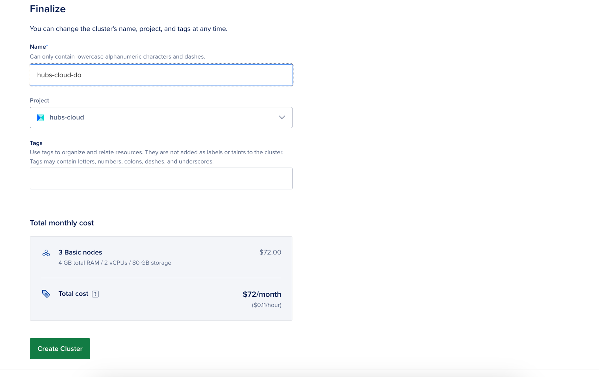Enter name, Select project and make sure to add a tag
**Finalise your Cluster: **Finally to create cluster you can set a name to your cluster like in our case it's 'hubs-cloud-do', you can leave the project name to 'first-project' or create a new one and make sure to **add a tag**. It takes 3-5 mins for the cluster to be ready to use. (while it's getting ready go ahead to step 3 and setup your SMTP server)
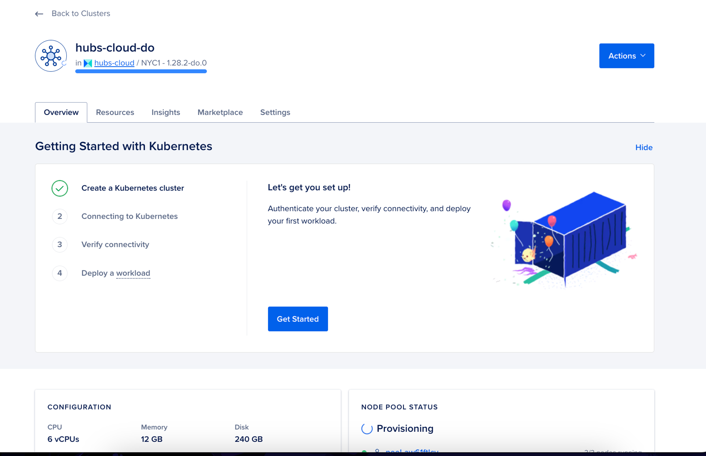

---

**Billing Note: **The cost that you see here is the cost of the cluster, you'll get a monthly bill of **$24 x no of nodes + $12 **
_When you're running it on a single node i,e. a capacity 30-60 CCUs, you'll be charged $36/mo_

---

## SMTP server setup

### Initial Setup - Part 3/4

SMTP 1/2 - Adding domain to elasticEmail

1. Go to [app.elasticemail.com](http://app.elasticemail.com/)/marketing and go to ‘Settings’
2. Once you are in the settings panel you need to add a domain here which you’ll be using to send emails from hubs (your community Edition).

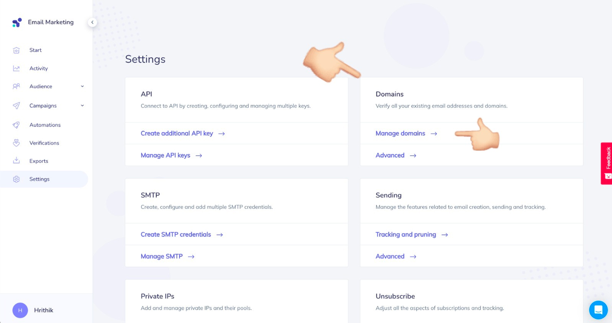Connecting your Domain
**Connecting your Domain: **From the Domains Category select Manage Domains and then add your new domain.
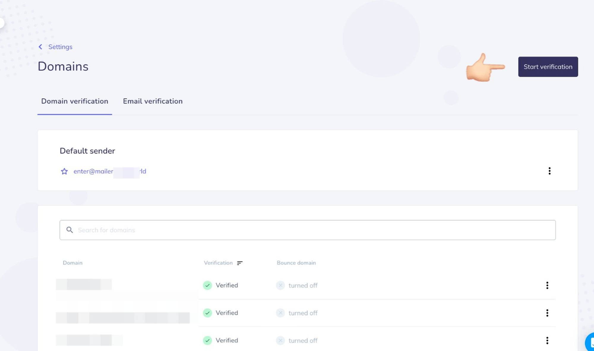Verifying your Domain
**Domain Verification: **In domain verification enter the domain you want to verify, then
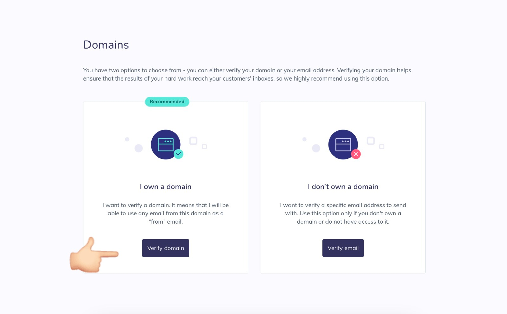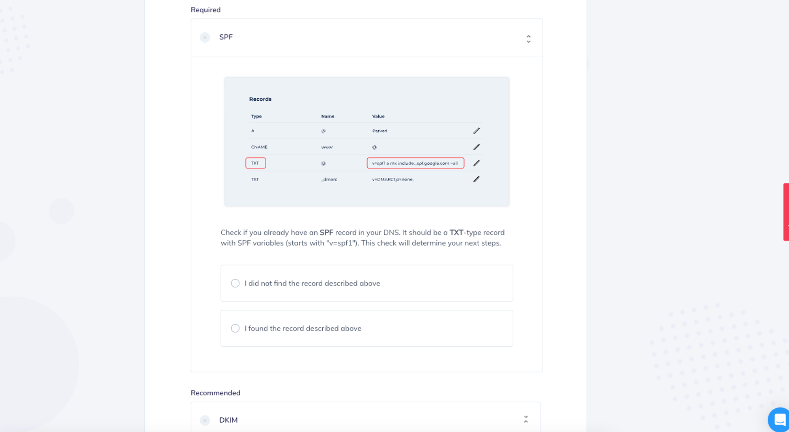
In adding records, select ‘I did not find the record described above’

Now, you need to add the three records ( SPF, DKIM, and TXT) and get them verified. Make sure to get all three records verified, by following these steps :

1. Visit [godaddy.com](http://godaddy.com/) and click on 'My Products' to view a list of all your purchased domains.

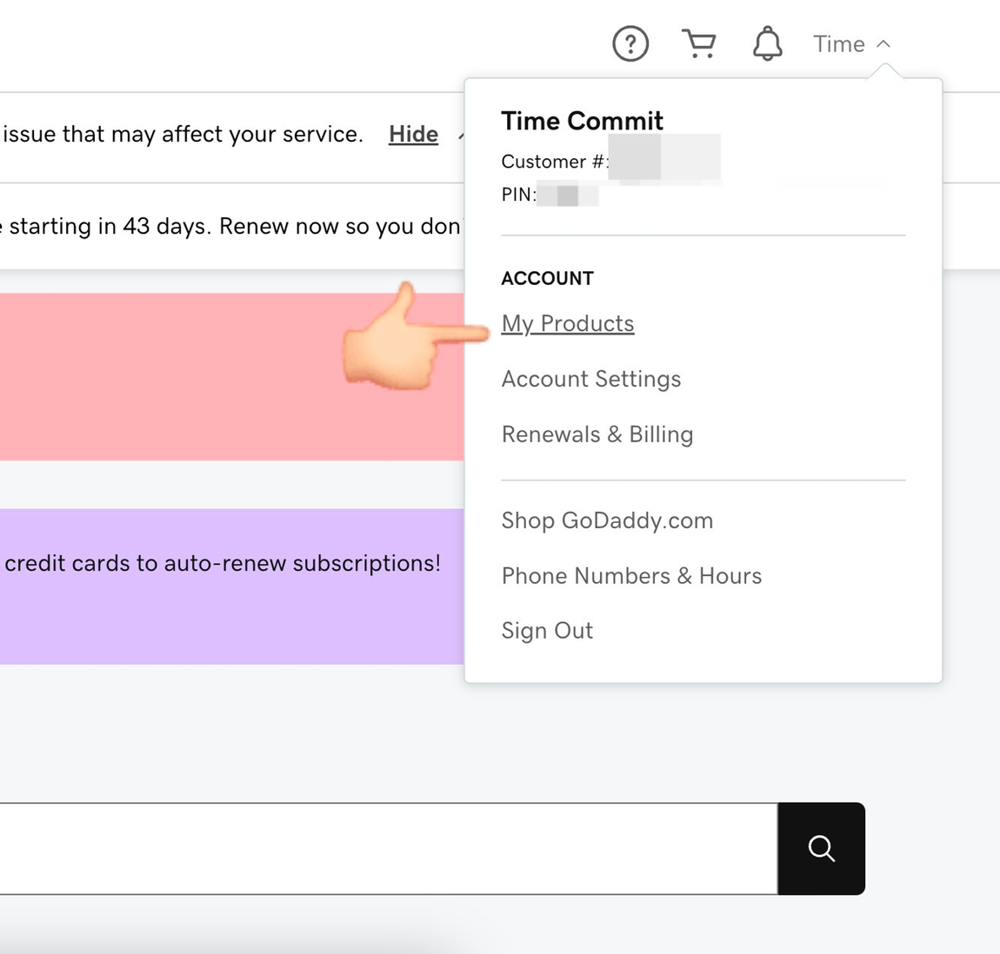
Access 'Manage All,' then select '[your-example.com](http://your-example.com/)' to initiate the process of adding the SPF, DKIM, and TXT records.

Access 'Manage All,' then select '[your-example.com](http://your-example.com/)' to initiate the process of adding the SPF, DKIM, and TXT records.

Once you have added the records you can go back to elastic email and click on the 'Finish' button, which will automatically scan the DNS records for your domain and confirm them for you
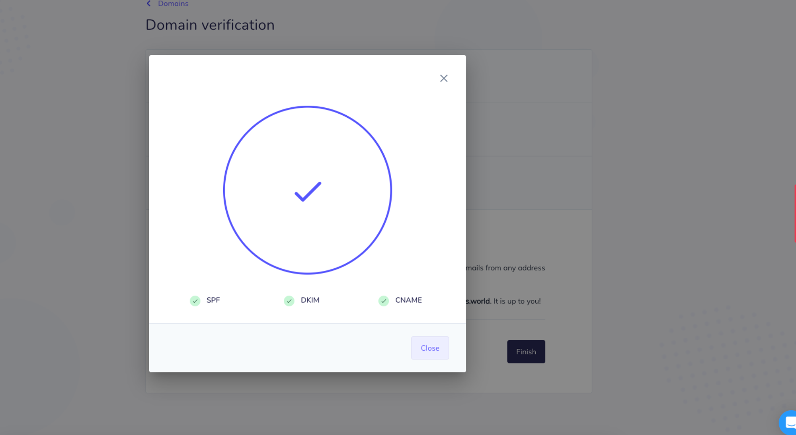Elastic Email scanning your DNS and verifying it for you
**Note for Cloudflare users: \***If you are using Cloudflare for your DNS Records Management, make sure to turn off proxy for the CNAME record to get it verified\*

## SMTP- 2/2 - Setting up SMTP Server

1. Go to elasticemail.com
2. Go to [https://app.elasticemail.com/marketing/settings/new](https://app.elasticemail.com/marketing/settings/new) and click on create smtp credentials

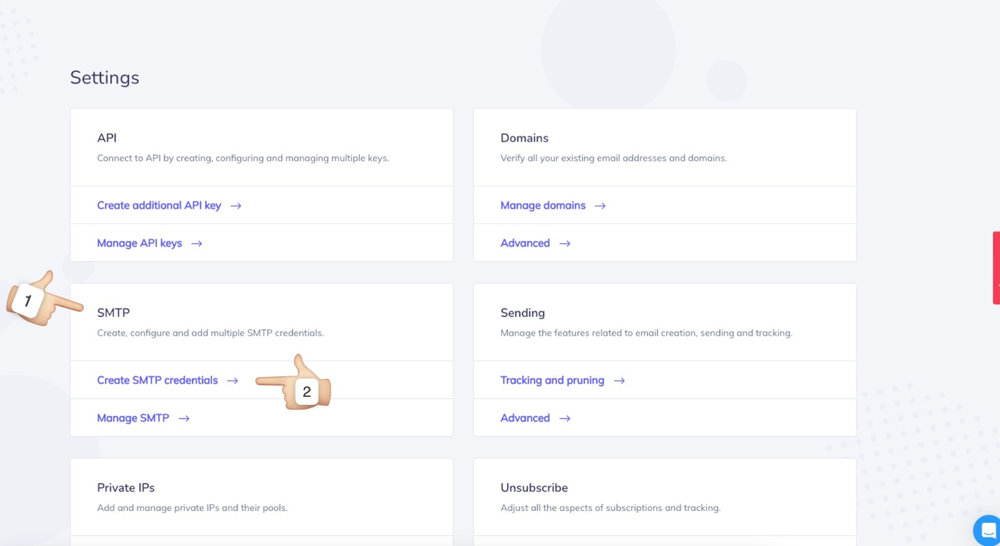Setting up username
**Setting up username**: your username should be `noreply@<your-domain>`.<your-tld> (eg: noreply@example.com )

Here we need to save/copy our password safely for use in next step

**Note for people losing passwords**: if you ever lose your password you can go to SMTP -> Manage SMTP -> Select your SMTP -> Three Dots -> Change Password
Changing Password in case it's lost

## Generating Config File

### Initial Setup - Step 4/4

1. Go to [https://github.com/mozilla/hubs-cloud](https://github.com/mozilla/hubs-cloud) and clone/download the repo on your local machine, in the terminal go to the folder where you want to clone it and run

> git clone https://github.com/mozilla/hubs-cloud

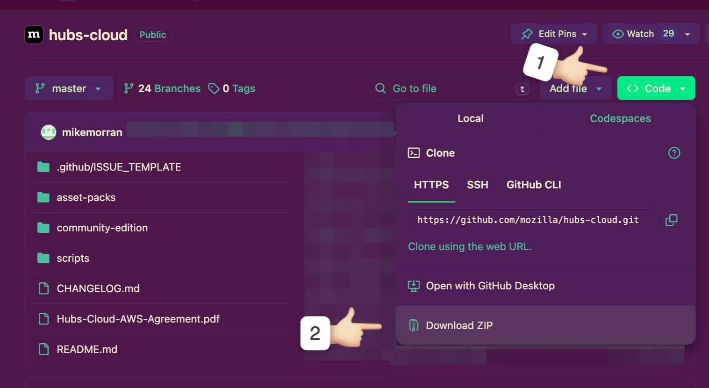Or if you don't have git, you can download the zip from here 2. In the cloned repo, opening it in vs code, we can find the `community-edition/render_hcce.sh` file which contains the values for us to get started with Here’s a better context on how to set the values of
a. HUB_DOMAIN: domain purchased from GoDaddy or Namecheap
b. ADM_EMAIL: Your **gmail** account that you’ll use to create account on your new hubs domain

    ### required
    export HUB_DOMAIN="example.net"
    export ADM_EMAIL="admin@example.net"

c. The SMTP server details goes like,

- SMTP_SERVER  & SMTP_PORT : These values correspond to the default server URL and port for Elastic Email. If you are not using Elastic Email, please modify them according to your SMTP server details
- SMTP_USER:  noreply@domain.com is the username used to create smtp credentials on elasticemail
- SMTP_PASS: The password copied in the previous step

  export SMTP_SERVER="smtp.elasticemail.com"
  export SMTP_PORT="2525"
  export SMTP_USER="changeMe"
  export SMTP_PASS="changeMe"

You can also change the NODE_COOKIE, GUARDIAN_KEY and PHX_KEY

we navigate to ‘community-edition’ folder via the terminal

> cd community-edition

And give your render_hcce.sh permissions

> chmod +x ./render_hcce.sh

and execute the docker file that we have by running

> docker build . -t hubs-ce-builder:latest

and later once it's successfully build, generate your file by

> docker run --rm -it -v .:/app hubs-ce-builder:latest

This creates the hcce.yaml file for us which we need to deploy to our kubernetes server spinned up on Digital Ocean

## Getting Ready for Deployment

### Deploying to Digital Ocean - Step 1/2

Go back to your digital ocean dashboard and first we need to setup an access token by selecting the API option from your left Sidebar
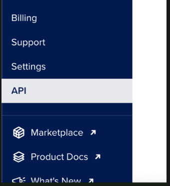
and in the view that appears, click on ‘Generate new Token’

Generate the new token with write access as well and copy the secret
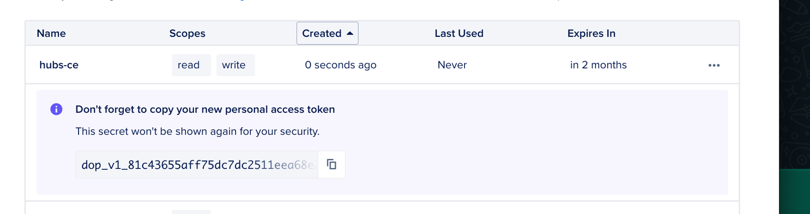
And in your computer’s terminal use

> doctl auth init --context <name>

In my example I used hubs-ce as my context name

> doctl auth list
> doctl auth switch --context <name>

**Note**: Kubernetes context and doctl context are both different, doctl context is for selecting the right account for docker and kubernetes context is for selecting the right context for kubernetes cluster.

2.** Connect to your Kubernetes Cluster using doctl**. We will follow the Automated method since we already have doctl setup and auth context created

Run this command and after running it you should be able to see a new kubernetes context added in your account. To see the list of context, go to your docker desktop icon and select Kubernetes context from the dropdown and you’ll see the newly added context already listed and also selected as well.
Change Kubernetes context from the dropdown of Kubernetes Context
Alternatively we can use the following command to list all the kubernetes contexts

> kubectl config get-contexts

listed kubernetes configs in your local system
or if you wish to directly get the current context this is how you do it

> kubectl config current-context

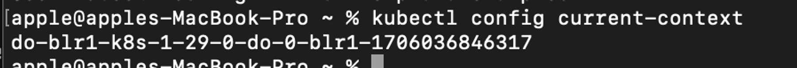Lists your current context : kubectl config current-context
Then**, Switch your Context **using

> kubectl config use-context <your-context-name-found-from-list>

## Deployment to Cluster

### Deploying to Digital Ocean - Step 2/2

At this point, we have completed our setup part, and we also have our YAML file with the namespace we wanted (in our case, we didn’t rename our namespace, so it will be `hcce.yaml`). The YAML file holds all the information about your deployment instructions that you want to give Kubernetes to create your file.

Now, we are ready to create an instance of Hubs for ourselves.

1. Go back to your cloned GitHub repo 'hubs-cloud,' and your current directory will be 'hub-cloud.' Change it to `community edition`.

> cd community-edition

2.  Now you need to deploy finally the hcce.yaml file to your kubernetes cluste

> kubectl apply -f hcce.yaml

    namespace/hcce created
    secret/configs created
    Warning: annotation "kubernetes.io/ingress.class" is deprecated, please use 'spec.ingressClassName' instead
    ingress.networking.k8s.io/ret created
    ingress.networking.k8s.io/dialog created
    …….

3. Get details about your deployment

> kubectl get deployment -n hcce

    > NAME            READY   UP-TO-DATE   AVAILABLE   AGE
    > coturn          1/1     1            1           2m13s
    > dialog          1/1     1            1           2m14s
    > haproxy         1/1     1            1           2m12s
    > hubs            1/1     1            1           2m16s
    > nearspark       1/1     1            1           2m15s
    > pgbouncer       1/1     1            1           2m16s
    > pgbouncer-t     1/1     1            1           2m16s
    > pgsql           1/1     1            1           2m17s
    > photomnemonic   1/1     1            1           2m14s
    > reticulum       1/1     1            1           2m17s
    > spoke           1/1     1            1           2m15s

It will take time for everything to be up and running, typically around 70-90 seconds

Ensure that everything shows the values 'ready' and 'up-to-date' as 1. Sometimes it doesn't; in that case, you want to delete the deployment and redeploy (repeat steps 2 and 3 after the steps listed below).

> kubectl delete deployment --all --namespace=hcce
> kubectl apply -f hcce.yaml

After your Kubernetes server is up, it'll take few more minutes to set up your loadbalancer, then, you need to point your domains to the IP address of the loadbalancer.

> kubectl -n hcce get svc lb

Here, you obtain the Kubernetes LoadBalancer's IP and the external IP address of your Kubernetes cluster. We need to note down the EXTERNAL IP for use in the next step.


> Congratulations!! if you have got your external IP, you have your community edition setup up & running on Digital Ocean Kubernetes Cluster

## Connecting Domain

### Deployment - Step 1/3

We need to go to our registrar and use the external IP address to configure and create four ‘A records’ with your external IP as the value. These values will point to the actual server.

Go back again to [godaddy.com](http://godaddy.com/) and click on My Products where it’ll show all your purchased domain

First, delete the parked record from GoDaddy. This is used as a placeholder that displays a welcome page. Select your A record, which has the data (value) set to 'Parked.’
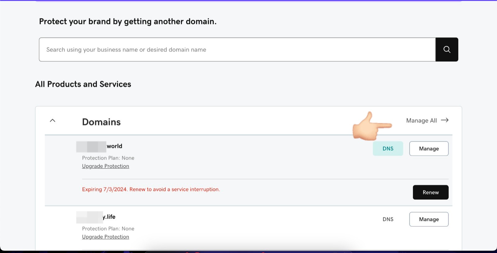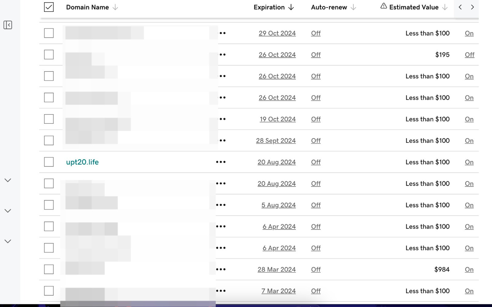
Now, we need to add the four records with the value set as our 'External IP' and click on "Save All Records.”

Now that we have our Hubs instance up and running, you can open your Hubs webpage in the browser to check if your SSL certificates are missing.
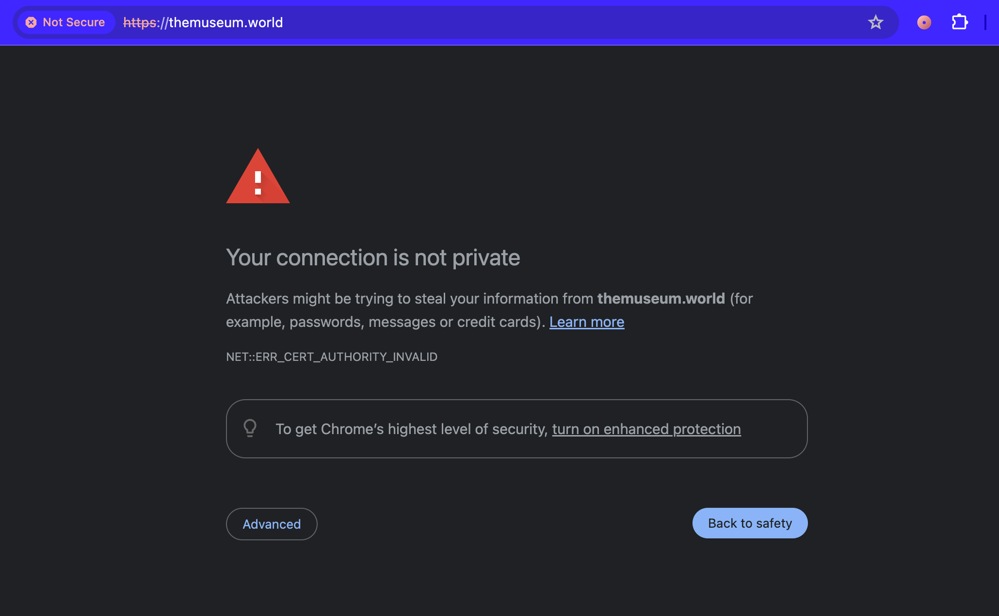

## Making it Secure (SSL Certificates)

### Deployment - 2/3

To add SSL certificates to our domain, we return to our VS Code, where we need to pass our email and domain once again in [cbb.sh](http://cbb.sh/) file (refer render_hcce.sh).

    export Namespace="hcce"
    export ADM_EMAIL="admin@example.net"
    export HUB_DOMAIN="example.net"

Afterwards,run the file by running

> bash cbb.sh

This will prompt us to install SSL for all the subdomains; simply press Enter to confirm. After it's complete, your instance is running successfully, and you can now sign in with your admin email.

When all the subdomains (i.e. cors.$HUBDOMAIN, assets.$HUBDOMAIN and stream.$HUBDOMAIN) are successfully registered, $HUBDOMAIN however isn't, you need to remove one line from your `hcce.yaml`.

Find and search for the following line

```
        - --default-ssl-certificate=hcce/cert-hcce
```

and then comment it out:

```
        #- --default-ssl-certificate=hcce/cert-hcce
```

After you did this, please reapply the configurtion and wait a short period of time. This should solve the domain issue.

```
> kubectl apply -f hcce.yaml
```

## Enabling Audio Chat and ScreenShare

### Deployment - 3/3

Now you have to whitelist few ports so that the voice chat and screenshare/video share work properly

1. Go back to your Digital Ocean dashboard and from the Network option from your left sidebar select ‘Firewalls’ and click on ‘Create Firewall’ button, after you name your firewall, whitelist the inbound rules for the given ports by referring the screenshot below

> TCP 4443
> TCP 5349
> UDP 35000-60000

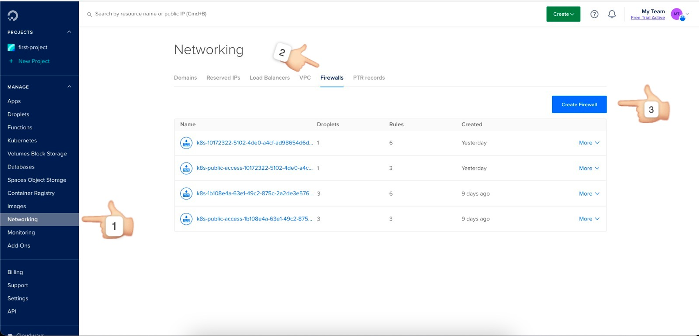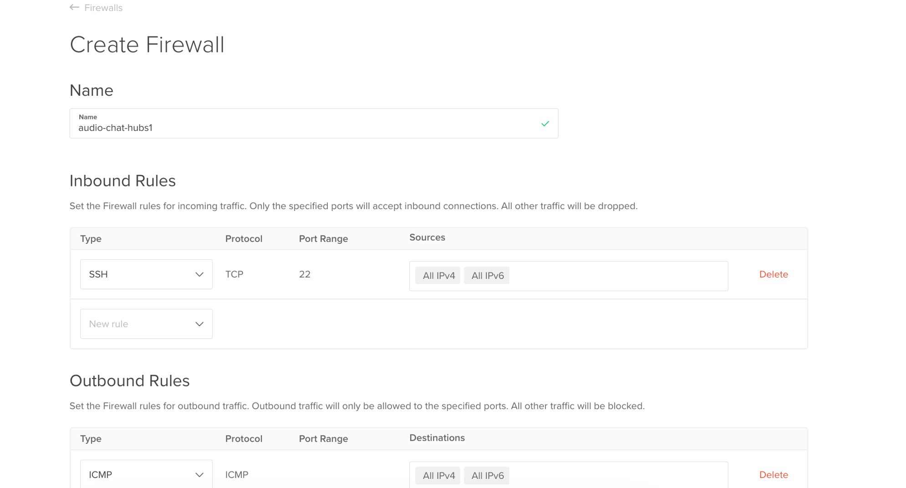
Note: you can disable/delete the SSH rule that comes predefined

Afterwards, search your cluster name on apply to droplets dropdown and select all the droplets to make sure that you have audio enabled on all of them.

**Note**: If you have added tags to your cluster, just use that one tag it's enough for all the nodes and node groups

At last apply your firewall settings by clicking on Create Firewall button


## Custom Code and Deployment

### Professional Setup: Steps 1/3

In this part we are going to run the code on our machine and  make changes to the code and deploy them to our server.

Go to [github.com/mozilla/hubs](http://github.com/mozilla/hubs) and fork the repo, if you are a developer and interested to get the latest updates first, make sure to get all the branches by **unchecking** ‘Copy the ‘master’ branch only’.

2.  Now we need to again clone our forked repository on our local machine, replace your ‘username’ with your github username

> git clone [https://github.com/](https://github.com/)<username>/hubs

You will have to **download** and **install nodejs v16.16**, if you don’t have nodejs installed go to [https://nodejs.org/en/download/ ](https://nodejs.org/en/download/)and download the nodejs current LTS version for your operating system. After you have a version of nodejs installed you can switch the version of nodejs using **n or nvm**

(Linux or Mac)  You can install 'n' just like any other npm package by running the command `npm install -g n` (in some cases you need to use ‘sudo’)

(Windows users): To switch using nvm follow these steps
a. Download and install NVM from the [NVM-windows releases page](https://github.com/coreybutler/nvm-windows/releases).
b. Open a new command prompt or terminal and type nvm install 16.16.0.
c. Switch to version 16.16 by typing nvm use 16.16.0.
d. Confirm the active version by typing node --version.

Once we have the node version 16.16 installed, we will go to our cloned repository folder and install all node modules

> node -v
> cd hubs
> npm ci

**Apple Silicon** users need to use yarn if they are failing at this step

> yarn install --frozen-lockfile

Now we have all necessary steps completed for running hubs on our local machine, we will now execute

> npm run dev

and go to [https://localhost:8080/](https://localhost:8080/) to access our hubs running locally, we will add a console log in our code before building our custom code version, for instance we have added our code in `src/react-components/home/HomePage.js` line 25 which shows up 4 times in the browser console

    export function HomePage() {
      console.log("Hello this is my custom code"); // Added this line
      const auth = useContext(AuthContext);
      const intl = useIntl();

## Building Docker Image

### Professional Setup - Step 2/3

As a developer you might need to frequently build and deploy for which you need to **setup CI/CD **in your github repo, in this case we will stick ourselves to building it locally.

Here are a few tips that will help you manage your images better:

- Images that you push to Docker Hub will be public by default.
- Your username serves as your registry.
- The images you create can have any tag you prefer; tags are similar to versioning for your image.
- For Tagging, use semantic versioning (e.g., 1.0.0, 1.1.0) for clearer version control.
- Tagging with 'latest' can be misleading; consider using it only for the most up-to-date production version.
- Add relevant labels to your images, such as the application name or environment, for better organization.
- Use unique tags for different environments (e.g., dev, staging, prod) to avoid confusion.

### Create Account on Docker Hub

Now we will proceed to build the image on our local system using docker and push the image to docker hub. So first head to hub.docker.com and create your account
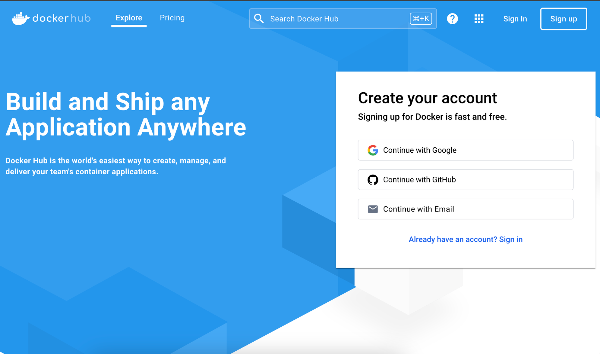

### Building Image from Dockerfile

To build the image, first we need to have a Dockerfile, create a Dockerfile in your hubs folder itself and paste all the content which is in RetPageOriginDockerfile
Creating our Dockerfile from existing RetPageOriginDockerfile
Run this command in your hubs folder

> docker build -t customhubs:v1 .

In the command above `customhubs` is the image name and `v1` is the tag, in your future builds you can keep increasing the number v1 to keep a track of your version number.

**Note for Apple Silicon\*\***users*\*\*: Build your image using the command below*

> docker build -t customhubs:v1 . --platform=linux/amd64

### Pushing our image to Docker Registry

After successful build (might take upto 45minutes depending on your Internet Speed) you can push your image to docker hub using

> docker push [docker-username:tag](docker-username:tag)

Now you have a docker image successfully published and accessible, to upload the image on your own kubernetes cluster, we have to go back to our hcce.yaml file (hubs-cloud repo) and change

    repository: mozillareality/hubs:stable-latest
    imagePullPolicy: IfNotPresent

to

    repository: <yourusername>/customhubs:v1
    imagePullPolicy: IfNotPresent

**Note\***: The imagePullPolicy should be changed to Always if you are going to push your image updates frequently and you want that everytime the pod is deleted you see your changes\*

To fetch the image again we can delete and recreate our deployment

> cd community-edition
> kubectl apply -f hcce.yaml
> kubectl delete deployment hubs --namespace=hcce

After this you go back to [yourhubs.com](http://yourhubs.com/) (your custom deployed hubs) and check the console logs for your message to verify that you’ve got your changes deployed

## Whitelisting domains and setting CORS

### Professional Setup: Step 3/3

To whitelist cors settings you need to understand few things to make sure on what each of these properties correspond to

1. connect_src: Any XHR request made via hubs counts as to be from connect_src, so whatever TLDs you whitelist for frame_src and img_src also need to be whitelisted in connect_src.
2. frame_src : If you are using iframes and visiting third party websites in iframe.
3. img_src: The domains used in  tag’s src attribute in your hubs custom client codebase
4. media_src: The domains used in <video> tag’s source attribute

   child_src = ""
   connect_src = "wss://\*.stream.<DOMAIN>:4443 example.com"
   font_src = ""
   form_action = ""
   frame_src = "example.com"
   img_src = "nearspark.reticulum.io example.com"
   manifest_src = ""
   media_src = ""
   script_src = ""
   style_src = ""
   worker_src = ""

If you are using Amazon s3 bucket or other bucket services to load objects in scene (3D Glb scene), videos, images,livestreams, etc.. you need to also whitelist them by adding them up in value of your `turkeyCfg_non_cors_proxy_domains`'s value

    spec:
          containers:
          - name: hubs
            image: <username>/<repo>:<tag>
            imagePullPolicy: IfNotPresent
            env:
            - name: turkeyCfg_thumbnail_server
              value: nearspark.reticulum.io
            - name: turkeyCfg_base_assets_path
              value: https://assets.$HUB_DOMAIN/hubs/
            - name: turkeyCfg_non_cors_proxy_domains
              value: "$HUB_DOMAIN,assets.$HUB_DOMAIN"

Similarly if you want to whitelist these links to be working in spoke you need to whitelist them in spoke’s turkeyCfg_non_cors_proxy_domains value

    spec:
          containers:
          - name: spoke
            image: mozillareality/spoke:stable-latest
            imagePullPolicy: IfNotPresent
            env:
            - name: turkeyCfg_thumbnail_server
              value: nearspark.reticulum.io
            - name: turkeyCfg_base_assets_path
              value: https://assets.$HUB_DOMAIN/spoke/
            - name: turkeyCfg_non_cors_proxy_domains
              value: "$HUB_DOMAIN,assets.$HUB_DOMAIN"

Note: Every time you make changes to your hcce.yaml and want the changes to be reflected on your live server, you need to reapply the config to your Kubernetes cluster by running:

> kubectl delete deployment --all --namespace=hcce
> kubectl apply -f hcce.yaml

The changes are also reflected without deleting all the pods, but sometimes the Reticulum pod doesn’t show the changes of frame_src and media_src (so better to delete all the deployments as in the above command using --all flag)

## Bonus: Installing a Kubernetes IDE

### Management Setup - Step 1/1

For this tutorial we’re selecting OpenLens - an Opensource Lens IDE, Go to [https://github.com/MuhammedKalkan/OpenLens?tab=readme-ov-file#installation](https://github.com/MuhammedKalkan/OpenLens?tab=readme-ov-file#installation) and select your system where you want to install, in our case we’ll do

> brew install --cask openlens


Here, you can view your list of pods and other details indicating the issues with your deployment. If you wish to delete or edit any pod, you can perform these actions from this interface. Just ensure that you select your namespace from the dropdown menu.

## Thank You

## Further Steps

Further if you have some feedbacks or would like to discuss something related to community edition, join our discord Server [https://discord.gg/hubs-498741086295031808](https://discord.gg/hubs-498741086295031808)

Follow us on [Twitter](https://twitter.com/MozillaHubs)
